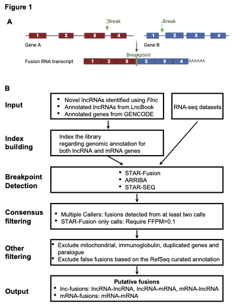

# LncFusion

## Introduction

LncFusion is a computational pipeline designed to identify both lncRNA-involved fusions (lnc-fusions) and mRNA–mRNA fusions from RNA-seq data. To achieve this, we build a comprehensive index of lncRNA and mRNA by merging references from LncBook (v2) and GENCODE (v42). We then employ three fusion callers—STAR-Fusion, Arriba, and STAR-SEQR—to detect candidate fusions. Putative fusions are retained if they are called by at least two tools or meet an FFPM (fusion fragments per million) threshold ≥ 0.1 for STAR-Fusion-only calls. Mitochondrial, immunoglobulin, or highly duplicated genes are removed to reduce false positives. Finally, fusions are classified into lnc-fusions (lncRNA–lncRNA or lncRNA–mRNA) and mRNA-fusions (mRNA–mRNA)



**Please cite our paper at *medRxiv* (https://medrxiv.org/cgi/content/short/2025.01.16.25320696v1), if you find LncFusion useful for your research. 

Version: 1.0.0

Last Modified: 08/13/2025

Authors: Zixiu Li (zixiu.li@umassmed.edu), Chan Zhou (chan.zhou@umassmed.edu)

Maintainer: Zixiu Li

## Prerequisites

To use LncFusion, you will need the following programs in your PATH:

•       apptainer (>=1.3.5)

•       python3 

•       OS: high performance computing cluster in Linux (suggested)

•       Reference genome: hg38


## Installation

### Step 1: Download LncFusion software from GitHub
```bash
cd /home/username/
git clone https://github.com/CZhouLab/LncFusion.git
cd LncFusion
chmod 755 *.py
```

### Step 2: Download LIB folder from Dropbox
```bash
cd /home/username/LncFusion
wget https://www.dropbox.com/scl/fo/qtxfwjn5r6zaxnpja3t06/AEtRNZgXXYKt-toZaw_-OQI?rlkey=vszfv5wgi62wwvbcdg6nq8ney&st=pq657m93&dl=0
tar -xzvf Lib.tar.gz
```

## Running LncFusion

**Note:**

-	LncFusion can accept the FASTQ files uncompressed (.fastq) or compressed by gzip (.fastq.gz) as input files.
-	LncFusion is recommended to be run on a computing cluster due to the high memory demands of STAR-Fusion, Arriba, and STAR-SEQR. In the LSF job script, #BSUB -n 20 specifies 20 CPU cores, and #BSUB -R rusage\[mem=20G\] requests 20 GB of memory per core.

**Usage** 
```bash

LncFusion.py [-h] -1 LEFT_FQ -2 RIGHT_FQ [-o OUTPUT_DIR] [-c CPU]

LncFusion: A method to identify lncRNA-derived fusion transcripts from RNA-seq data.

Required arguments:

	-1 --left_fq 	Path of the mate 1 file of paired FASTQ files, paired with the mate 2 file specified with "-2 " option.
	-2 --right_fq 	Path of the mate 2 file of paired FASTQ files, paired with the mate 1 file specified with "-1 " option. 

Optional arguments:
	-o --output_dir	Path of the output folder.
			Default: ./LncFusion_output
	-c --CPU	number of threads.
			Default: 20
	-h/--help 	Show help message and exit
```

## Example
**LSF job script (LncFusion.lsf)**
```bash
#!/bin/bash

#BSUB -L /bin/bash
#BSUB -q long
#BSUB -n 20
#BSUB -W 4:00
#BSUB -J LncFusion
#BSUB -o LncFusion.out
#BSUB -e LncFusion.err
#BSUB -R rusage[mem=20G]
#BSUB -R span[hosts=1]

module load apptainer/1.3.5
module load python3

python3 LncFusion.py -1 BT474f_1.fq.gz -2 BT474f_2.fq.gz -o BT474f
```
**Submit the job to the cluster**
```bash
bsub <LncFusion.lsf
```

## Output files
LncFusion will generate two output files, which can be found in the output folder inside your specified output directory.

**(1) FusionGene_Annotation.txt**: a tab-delimited text file containing information about each detected fusion gene. The columns are defined as follows:
| Field(column)| Description                                   |
| :-----------:| :---------------------------------------------|
| FusionGene	       | Fusion gene identifier in the format HeadGene::TailGene |
| FusionType	       | Fusion category (e.g., lncRNA-fusion, mRNA-fusion) |
| HeadGene_Biotype	       | Biotype of the head (5′) gene (e.g., protein_coding, lncRNA) |
| TailGene_Biotype    | Biotype of the tail (3′) gene (e.g., protein_coding, lncRNA) |
| HeadGene_Location     | Genomic coordinates of the head gene in the format chr:start-end:strand |
| TailGene_Location  | Genomic coordinates of the tail gene in the format chr:start-end:strand |
| Genomic_Oigination     | Genomic relationship between the head and tail genes, indicating whether the fusion is intra-chromosomal (same chromosome, same or opposite strand) or inter-chromosomal (different chromosomes). For intra-chromosomal fusions, also specifies whether the tail gene is located genomic upstream or downstream relative to the head gene |
| Distance(HeadGene,TailGene)    | Genomic distance between the head and tail genes in base pairs. For fusions on different chromosomes, or on opposite strands even within the same chromosome, the value is reported as Inf |


**(2) Breakpoint_Annotation.txt**: a tab-delimited text file summarizing detected fusion events at the breakpoint level. Each row corresponds to a specific fusion breakpoint pair, and columns are defined as follows:
| Field(column)| Description                                   |
| :-----------:| :---------------------------------------------|
| BreakPoint	       | Genomic coordinates of the fusion breakpoints in the format chr<chrom1>:<position1>:<strand1>_chr<chrom2>:<position2>:<strand2>. The first coordinate corresponds to the head breakpoint, and the second to the tail breakpoint |
| FusionGene	       | Fusion gene identifier in the format HeadGene::TailGene |
| FusionDetectionTool	       | Semicolon-separated list of fusion detection tools that identified the event (e.g., STAR-Fusion;STAR-SEQR;Arriba) |
| Distance(HeadBreakPoint,TailBreakPoint)    | Genomic distance between the head and tail breakpoints in base pairs. If located on different chromosomes, or on opposite strands within the same chromosome, the value is reported as Inf |
| JunctionReadCount     | The number of paired end discordant reads, reported as the maximum value obtained across all three fusion detection methods |
| SpanningFragCount  | The number of paired end reads spanning the exact fusion junction, reported as the maximum value obtained across all three fusion detection methods |
| FFPM    | Fusion fragments per million total reads |
